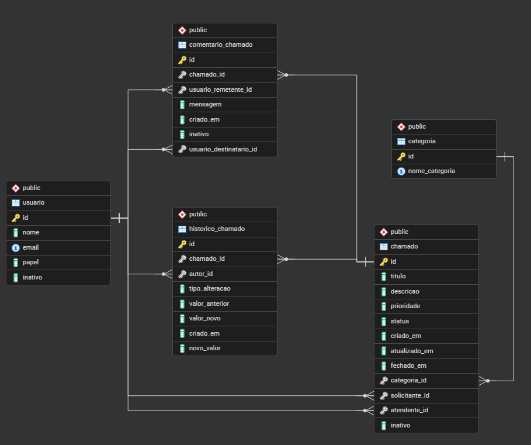

# Help Desk API

API REST em Java para registrar, organizar e acompanhar chamados de suporte.

## Tecnologias

- Java 21
- Spring Boot 4.0.7
- Spring Data JPA / Hibernate
- PostgreSQL
- Swagger (OpenAPI)

## Recursos

- Usuários com os papéis `COLABORADOR`, `ATENDENTE` e `ADMINISTRADOR`.
- Categorias, chamados, comentários e histórico de alterações.
- Filtros de chamados por status, prioridade, categoria e solicitante.
- Exclusão lógica para chamados e comentários.
- Auditoria de criação, atualização e fechamento do chamado.

## Modelo de dados



Principais relações: uma categoria possui chamados; um chamado possui solicitante, atendente, comentários e histórico;
cada comentário possui remetente e destinatário. O histórico também referencia o usuário autor por `autor_id`.

## Endpoints

| Recurso           | Operações                                                                                                                  |
|-------------------|----------------------------------------------------------------------------------------------------------------------------|
| `/v1/usuarios`    | listar, criar, buscar por ID/e-mail, alterar papel e inativar                                                              |
| `/v1/categorias`  | listar, criar, buscar por ID e excluir                                                                                     |
| `/v1/chamados`    | criar, listar, consultar, atribuir atendente, alterar prioridade/status, finalizar, reabrir, consultar histórico e excluir |
| `/v1/comentarios` | listar, criar em um chamado, alterar mensagem, excluir um ou todos                                                         |

A documentação detalhada e interativa está disponível em `http://localhost:8080/swagger-ui/index.html` com a aplicação
em execução.

## Executar localmente

1. Crie um banco PostgreSQL chamado `helpdesk`.
2. Configure as credenciais:

```powershell
$env:DATABASE_USERNAME="seu_usuario"
$env:DATABASE_PASSWORD="sua_senha"
```

3. Inicie a API:

```bash
mvn spring-boot:run
```

O Hibernate está configurado com `ddl-auto: update`; portanto, criará/atualizará as tabelas conforme as entidades.

## Status do projeto

O núcleo do Help Desk está implementado. Autenticação e autorização via JWT/Spring Security são evoluções futuras.
